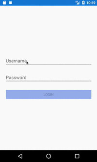
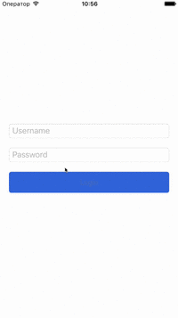

Overview
--------

Xamarin Reactive Example is a simple application that I use to research how well
Xamarin and ReactiveUI play for Android and iOS.

Currently this application:
* displays XAML page with login fields
* enables login button only when those fields are not empty
* displays activity indicator while login process is in progress
* fakes login process by running an async delay

Preview
-------
| Android | iOS |
|  |  |

